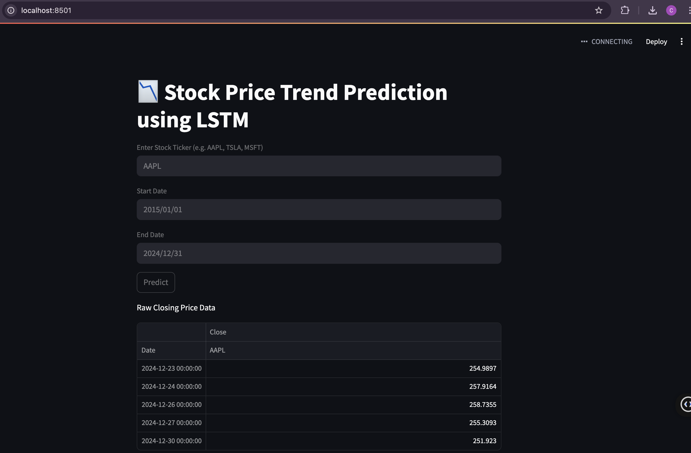
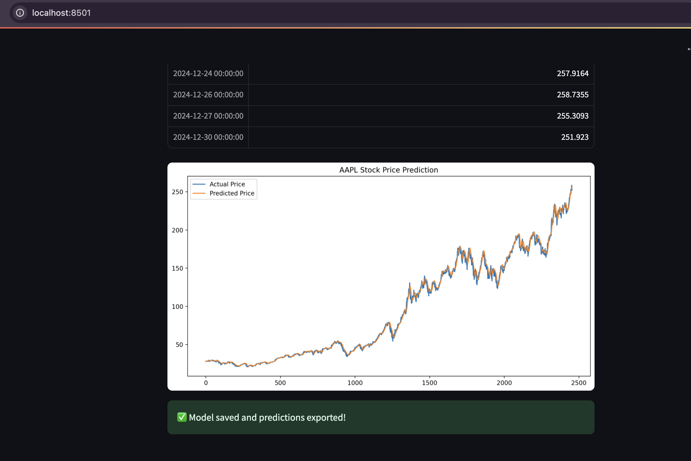

# 📈 Stock Price Trend Prediction using LSTM

This project is a deep learning-based application built with **TensorFlow** and **Streamlit** to predict stock price trends using historical closing data. It fetches live stock data from **Yahoo Finance**, preprocesses it, trains an **LSTM neural network**, and visualizes actual vs. predicted prices interactively.

---

## 🚀 Features

- 🔍 Real-time stock data fetch (AAPL, TSLA, MSFT, etc.)
- 🧠 LSTM-based time series forecasting using Keras
- 📉 Prediction and visualization of closing stock prices
- 💾 Model and prediction saving
- 🖥️ Clean interactive web UI using Streamlit

---

## 📸 Demo


*Streamlit app interface*


*Actual vs. Predicted stock price*

---

## 📦 Tech Stack

- Python 3.10
- TensorFlow / Keras
- Streamlit
- yfinance
- NumPy, Pandas, Matplotlib
- Scikit-learn (MinMaxScaler)

---

## 📁 Folder Structure

```
stock_forecasting/
├── app.py
├── data_fetcher.py
├── model.py
├── preprocess.py
├── predict.py
├── lstm_stock_model.h5
├── predictions.csv
├── requirements.txt
├── run.sh
└── README.md
```

---

## 🛠 How to Run Locally

### 1. Clone the Repo
```bash
git clone https://github.com/yourusername/stock-price-predictor.git
cd stock-price-predictor
```

### 2. Create & Activate Virtual Environment (Python 3.10)
```bash
python3.10 -m venv venv_tf
source venv_tf/bin/activate
```

### 3. Install Dependencies
```bash
pip install -r requirements.txt
```

### 4. Run the App
```bash
streamlit run app.py
```

Then open: [http://localhost:8501](http://localhost:8501)

---

## ✅ Usage

1. Enter a valid stock ticker (e.g., `AAPL`, `TSLA`)
2. Choose date range (e.g., `2015-01-01` to `2024-12-31`)
3. Click **Predict**
4. View actual vs. predicted prices
5. Model and predictions are saved locally

---

## 📌 Future Work

- 🔮 Forecast next 30 days of prices
- 📊 Make it multivariate (Open, High, Low, Volume)
- ☁️ Deploy to Streamlit Cloud
- 📦 Add model download button
- 📱 Mobile responsive design

---

## 👩‍💻 Author

**Chaitrali Kadam**  
M.S. Computer Science – University of Colorado Denver  
[LinkedIn](https://linkedin.com/in/chaitralikadam) | [GitHub](https://github.com/chaitrali2411)

---

## 🛡 License

This project is open-source under the [MIT License](LICENSE).
